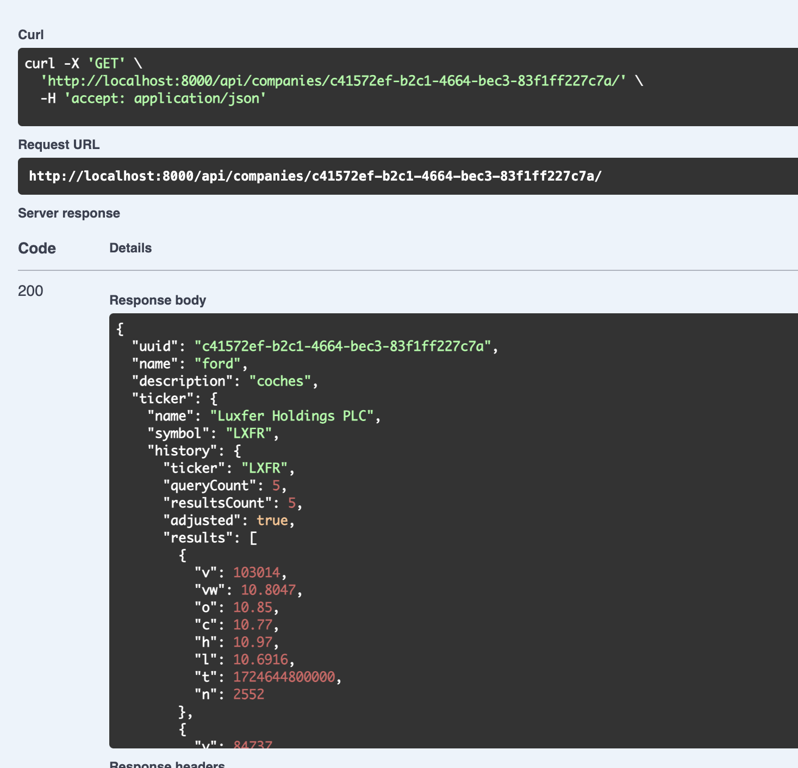

## Index

1. **Introduction**
   - Overview
   - Key Features
2. **Installation**
   - Prerequisites
3. **Usage**
   - Basic Usage
   - Advanced Configuration
4. **Examples**
5. **Architecture**
   - Key Components (Note: This project uses Django, PostgreSQL, and Nginx as key components)
6. **Contributing**
   - How to Contribute
   - Code of Conduct
7. **License**
   - License Information (This project is licensed under the MIT license)
8. **Contact**
   - Support (elbic@github.com)
   - Feedback

## Introduction

Webull Backend is a Django application built using Cookiecutter-Django, designed to provide a robust backend infrastructure for webull applications.

### Overview
This project utilizes Docker and Docker Compose for containerization and deployment, ensuring seamless integration with other services.

### Key Features
- Built with Django framework for efficient development and scalability.
- Utilizes PostgreSQL as the primary database management system.
- Leverages Nginx as a reverse proxy server for load balancing and caching.
- The [Polygon.io](https://polygon.io/) Stocks API provides REST endpoints that let you query the latest market data from all US stock exchanges. You can also find data on company financials, stock market holidays, corporate actions, and more.

## Usage

### Basic Usage
Create a Polygon account to retrieve financial data and update the API KEY in `.envs/.production/.django`
```
# Polygon
# ------------------------------------------------------------------------------
POLYGON_API_KEY=
```

To use this project, start by building and pushing Docker images using
```
docker-compose -f docker-compose.local.yml build
docker-compose -f docker-compose.local.yml up
```
After deployment, run the following commands to create a superuser and extract NYSE tickers:
```
docker-compose -f docker-compose.local.yml run --rm django python manage.py createsuperuser
docker-compose -f docker-compose.local.yml run --rm django python manage.py extract_tickers nyse
```
Login into the Django Admin with the created user

Visit http://localhost:8000/api/docs/ to see the API Documentation


### Advanced Configuration
Refer to the `docker-compose.yml` file for detailed configuration options.

## Examples



## Architecture

### Key Components
- **Django Application Server**: Handles backend logic and business processes.
- **PostgreSQL Database Management System**: Manages data storage and retrieval for the application.
- **Nginx Reverse Proxy Server**: Acts as a load balancer and caching layer between clients and the Django application server.

## Contributing

### How to Contribute
To contribute to this project, please fork this repository, make necessary changes, and submit a pull request with clear explanations of your contributions.

### Code of Conduct
This project adheres to the Contributor Covenant code of conduct. Please refer to the [Contributor Covenant](https://www.contributorcovenant.com/) website for more information.

## License

This project is licensed under the MIT license. For more information, please see the [LICENSE](LICENSE) file in this repository.

## Contact

### Support
For support or questions regarding this project, please contact elbic@github.com.

### Feedback
We appreciate your feedback and suggestions to improve this project.
